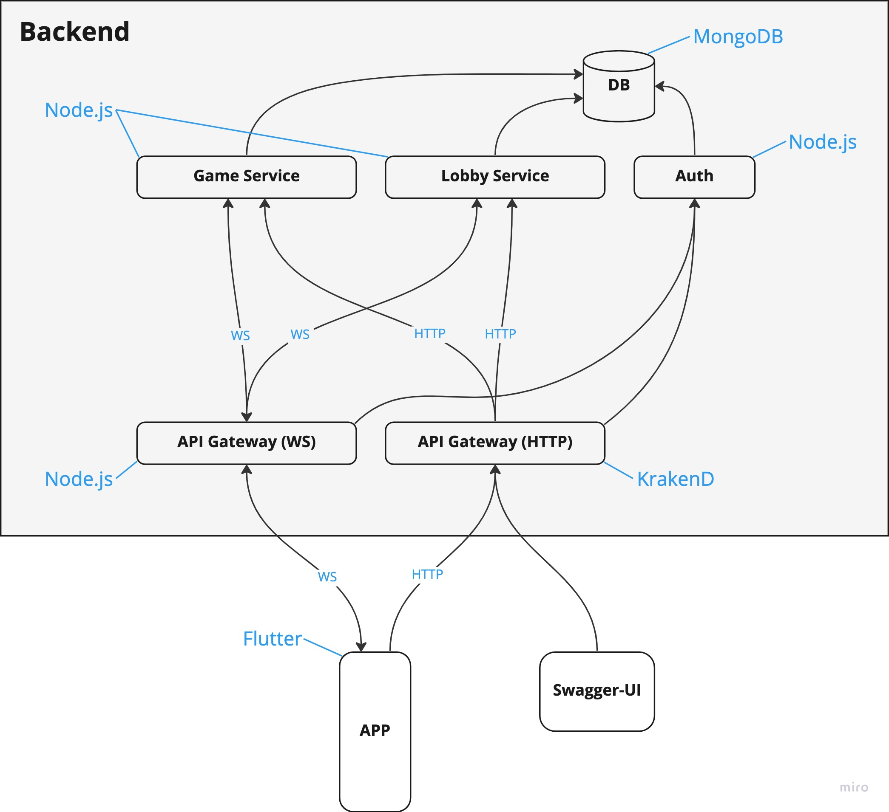

# Rock Paper Scissors backend
This repo contains a backend of a university group project for a subject called 'web applications'. The goal is to create an online rock paper scissoes game, where people will be able to play against each other.

Backend consists of several microservices each run in docker using compose. This repo contains all those microservies along with configuration files to run everything.
> Ideally it would be a better practice to have a separate repo for each service, however for the purposes of the project it isn't necessary as we won't need to manage versions, implement sophisticated deployment techniques, etc. 

> One Repo to rule them all, One Repo to find them, One Repo to bring them all and in the docker bind them.

## Architecture and description
*Things you are gonna read down below might be a subject for constant change*

Planned services:
- Game Service - a service that manages the game, saves the players' choices and provides the player with the choice of another player in a given round.
- Lobby Service - a service that allows you to get open lobbies that you can join, connect or create your own lobby.
- API Gateway - mainly going to deal with authorization and routing

Users will use the mobile/web application.

Technologies:
- Node.js - runtime environment for JS (for backend microservices)
- Express, WS - libraries for HTTP/WebSocket servers
- MongoDB - a database for storing users and common information about games
- Mongoose - a library to connect to the database from microservices
- Flutter - a set of tools designed to create native applications for various platforms

## How to run the backend?
1. Install Docker https://www.docker.com/
2. Clone project
3. Launch Docker on your machine
4. In project directory run `docker-compose up --build`.
5. You now have everything set up (at least in theory). Try to make a request to one of the services using apps such as Postman (or a browser of your choice

## How to contribute?
1. Create a branch for a feature you want to add
2. Push the branch to origin
2. Create a pull request and request a review from one of the team members

## API
To view the endpoints available to the frontend please visit swagger. 
Swagger is hosted as a separate service and is available under the 8081 port (unless you specifically change docker compose file). 
If you run the backend on your local machine, just open your browser of choice and proceed to http://localhost:8081/

## Useful resources
Docker overview
https://youtu.be/gAkwW2tuIqE

Docker volumes
https://youtu.be/p2PH_YPCsis

JWT
https://youtu.be/7Q17ubqLfaM

Getting started with Node.js
https://nodejs.dev/en/learn/

Express
https://www.tutorialspoint.com/nodejs/nodejs_express_framework.htm

WS
https://www.pubnub.com/blog/nodejs-websocket-programming-examples/

Mongoose getting started
https://mongoosejs.com/docs/