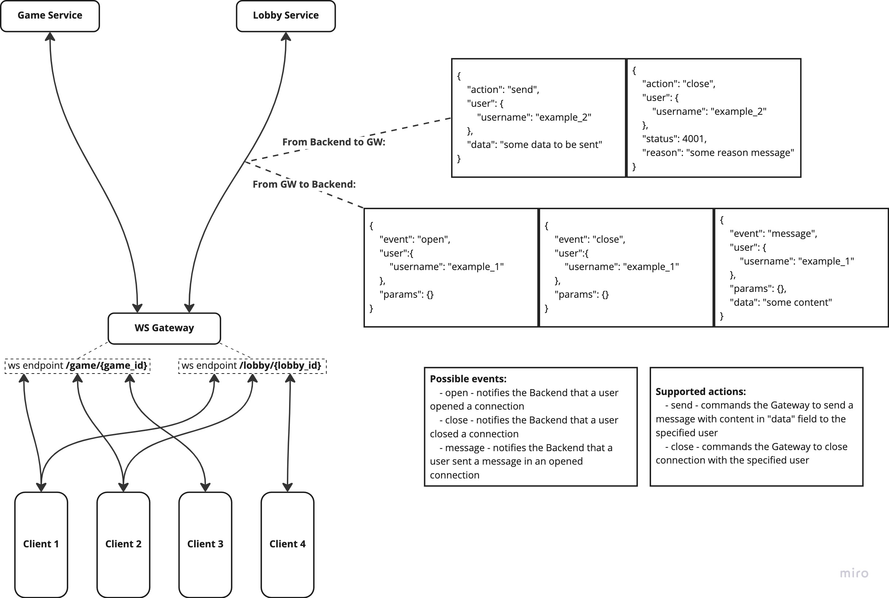

# API Gateway
This service serves as a single centralized entrypoint to the backend. Only this service is available from the "outside world". The rest of the services are located in an internal docker network and are inaccessible. 
The main purpose is to handle authorization (so that internal services don't have to) and to route requests/connections.

Backend offers functionality both over HTTP and WebSocket.

## Authorization
The backend uses JWT as an authorization method. Clients are expected to send their tokens within the Authorization header when they attempt to use a protected endpoint.

# HTTP
For available http endpoints that you can use as a client please visit SwaggerUI. Information on how to get there you can find [here](https://github.com/Neterpila/Rock_paper_scissors_backend#api)

In case of HTTP endpoints the gateway serves as a rather simple proxy that verifies the validity of the JWT token (where it is required) and responds with 401 if it's not. If the token is valid though, it simply sends the request further to a backend service and responds with it's response.

HTTP endpoints are configured by a [json file](./app/http/config.json)

For endpoints marked as *auth_required* the gateway also and an additional header in it's request to a backend service. This header contains the information about the user calling the endpoint. Header is simply a json: 
**User: {"username":"the_dude_lebowski"}**

# WebSocket
When it comes down to WebSocket connections, things get a bit more complex. 

If you are interested on how connect to WS endpoints and how to use them as a client, please visit the following READMEs: 
- [Lobby](../lobby) 
- [Game](../game/)

Below you will find a detailed explanation of the inner workings of the gateway and it's communication with backend services.

## Key concepts and core assumptions
### Connection with backend
Websocket connections are rather pricy in terms of resources. That's why instead of creating a new connection with the backend service for each new client, the gateway creates only one connection with each service during startup. Within this single connection the gateway talks to the specific backend service in a certain language to let the backend know what happened and to which client, and also expects to receive specific messages from the backend with instructions on what to do with which cliend. More on that later.

### Limitations
Any given client will only need (and be able) to use a single instance of backend functionality at a time. For instance: a client won't be able to join several lobbies simultaneously or participate in several games simultaneously.

Only one token bearer may simultaniously be connected to any given part of functionality. For instance: a user (being authorized as such) will not be able to play the same game from 2 (or more) different devices. 
This limitation is somewhat arbitrary, but allows to simplify the implementation.

Therefore the gateway can identify every client connection by:
- username from the jwt passed by the client
- part of functionality the cllient wants to use - in our case it is either something related to lobby (joining, chatting, etc.) or something related to actual game (making moves etc.) - which is very convenient, as these are provided by 2 backend services.

## Implementation
After considering everything explained in the previous chapter the following concept emerges:  

  
Takeaways:
- gateway keeps one WS connection at all times to any backend service
- gateway provides one WS endpoint for each part of functionality (de facto for each backend service)
- depending on the actions of clients on those endpoints, the gateway propagates messages to the corresponding backend
- messages sent between the gateway and backends have a specified format (language, if you wish)

### The language
#### Key concept
The gateway by itself does not know what to do with each client - this is the responsibility of backends. 
The gateway <ins>informs</ins> the backend about what happens to its corresponding ws endpoint. In other words the gateway sends <ins>events</ins> to a backend. 
Depending on what happens, a backend <ins>commands</ins> the gateway to do something with a specific client. In other words a backend sends <ins>actions</ins> to the gateway.

#### How it works
All of the messages sent within the connections from gateway to backends are expected to be a JSON string.

All messages that are sent both sides are required to have a 'user' field. It contains the information about the authorized user using a gateway ws endpoint.

Messages sent from the gateway to a backend always have an 'event' field that specifies *what* happened. 
There are currently 3 options:
- open - a client opened a ws connection to an endpoint
- message - a client sent a message the opened connection
- close - a client closed the connection they opened earlier

Messages sent from a backend to the gateway are required to have an 'action' field. 
There are 2 options:
- send - commands the gateway to send a specified messsage back to the client
- close - commands the gateway to close the client connection with the specified code and reason
